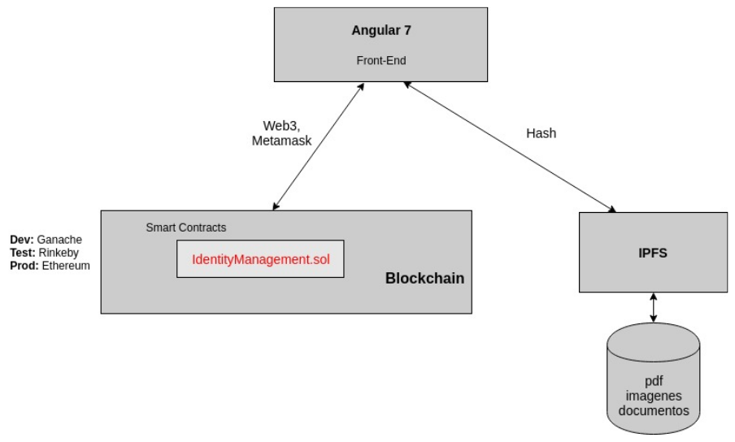

# Identidad Digital Soberana / Self Sovereign Identity 

# Spanish Version

[Go to English Version](#english-version)

# Diagrama de Arquitectura

# Requerimientos de Tecnologías para correr la Demo en forma local:

- Angular 7
- Node v8.10.0
- Truffle v5.0.21 (core: 5.0.21)
- Solidity v0.5.0 (solc-js)
- Web3.js v1.0.0-beta.37
- Ganache v2.0.1
- Metamask 6.7.2
- IPFS Client 0.36.4
- Git 2.17.1

# Pasos a Seguir para correr la Demo:

1) Descargar el Proyecto de GitHub
https://github.com/danielmirdem/identidad-digital-soberana

2) Ejecutar Ganache
https://www.trufflesuite.com/ganache

3) Conectar Metamask a Ganache
https://www.youtube.com/watch?v=jNQLnq8aNuA

4) Hacer el deploy con Truffle

    $ truffle deploy

5) Dentro del directorio del proyecto/app/identity ejecutar:

    $ ng serve

6) Ya puede probar la Demo:

http://localhost:4200/

http://localhost:4200/inicio/2

# English Version

[Go to Spanish Version](#spanish-version)

# Architecture Diagram

